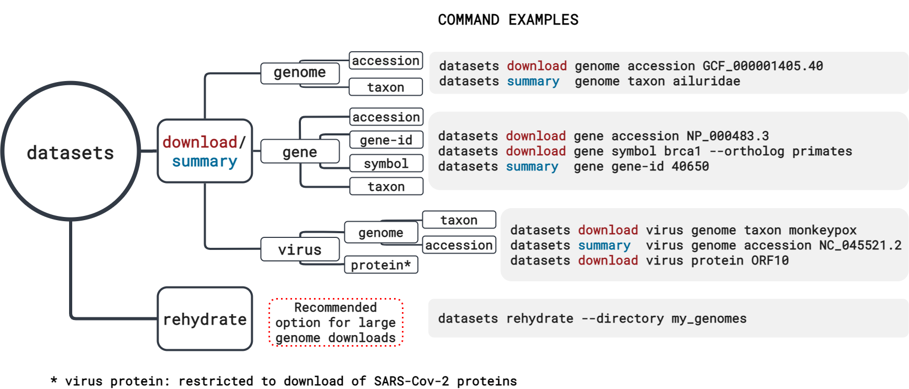
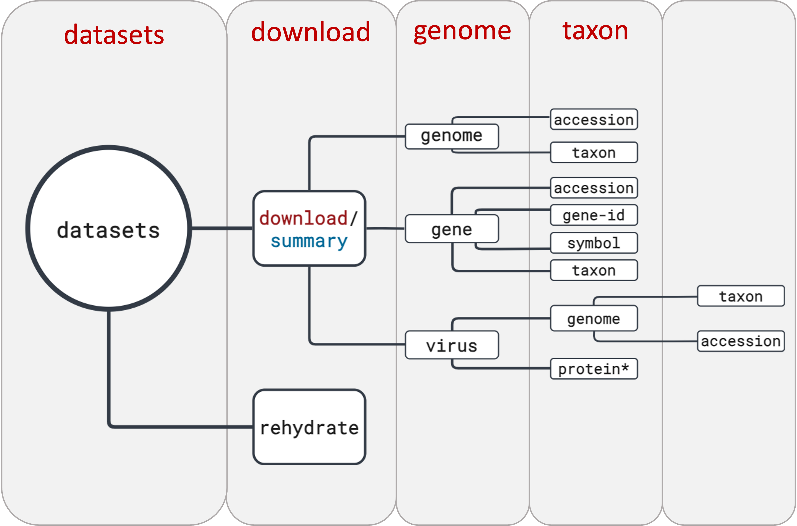
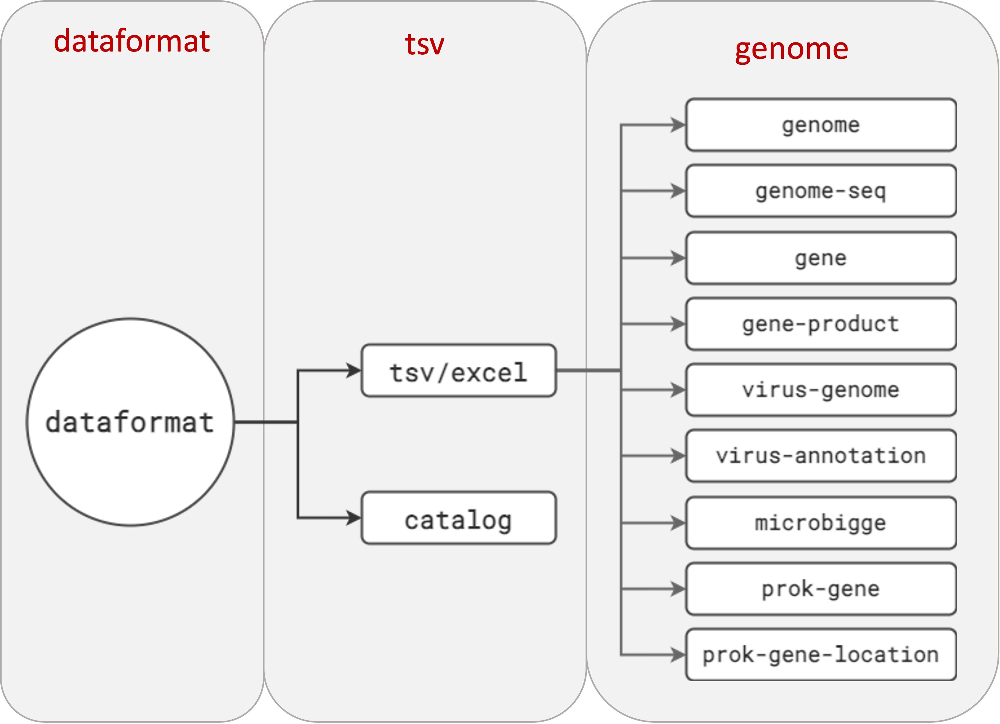
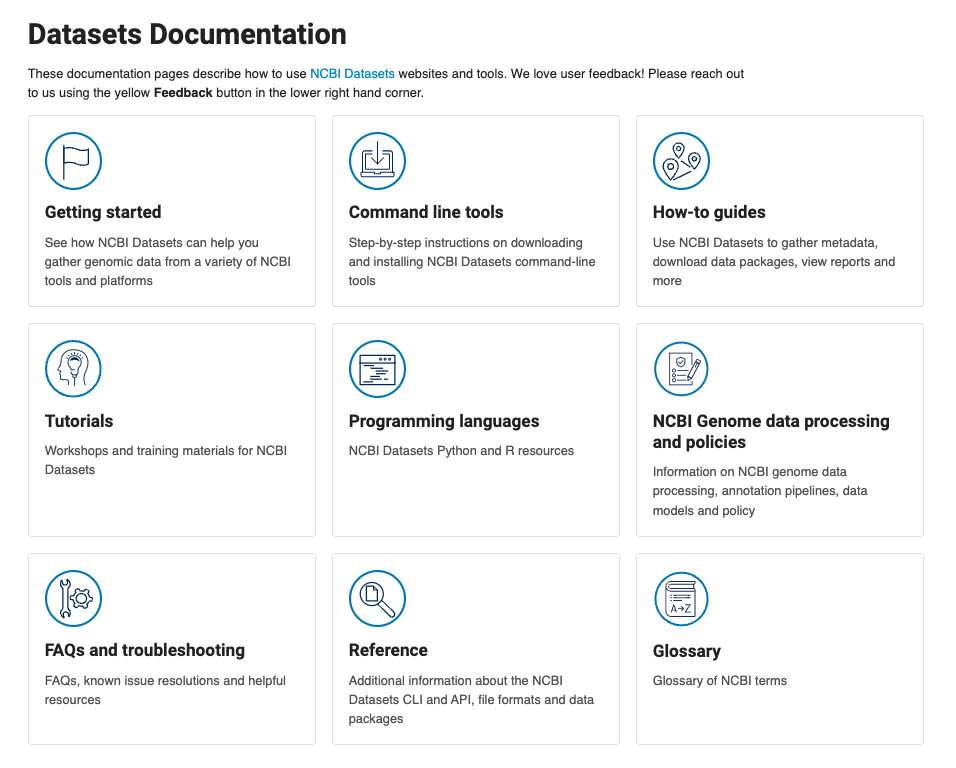

# Searching and Downloading Genome Data using NCBI Datasets

### Table of contents
1. [NCBI Datasets: the CLI version](#datasets-cli)  
	1a. [Installing NCBI datasets](#installation)
2. [Genome retrieval options](#genome-retrieval). 
3. [Using the *datasets* CLI to download a single genome assembly](#single-genome)
4. [How can I download multiple genomes at once using *datasets*?](#multiple-genomes)  
	4a. [Using *dataformat* to explore metadata](#genome-metadata)
5. [Datasets documentation and tutorials](#docs)
6. [Bonus exercise: downloading a large number of genomes](#rehydration)

### 1. NCBI Datasets: the CLI version <a name="datasets-cli"></a>

NCBI Datasets comprises an API, a web-interface and a command-line tool (CLI). In this workshop, we already covered the web-interface and how it can be used to search and download for your genomes of interest. 


As useful as the web interface is, at times it's much more convenient to have a way of accessing genomes from a command-line environment. Let's say your working on your institution's high-performance computing (HPC) system and you need to download dozens (or hundreds of genomes). Even if you're using the Datasets web interface, this would potentially be a two step process: 

1. Download the genome data package locally;
2. Transfer the files to the HPC system.

With the NCBI Datasets CLI, you can do this process in a single step. Our CLI allows users to access not only genomes, but also genes, ortholog sets and virus genomes. 



#### 1a. Installing NCBI Datasets <a name="installation"></a>

For this exercise, we will install the *datasets* CLI in the [GitPod](https://gitpod.io/#https://github.com/BGAcademy23/ncbidatasets) instance you are using. The same instructions can be followed to to install it on your own machine or HPC system.

The list of commands below will accomplish the following tasks:  

1. Create a new conda environment named `datasets` and install the *datasets* CLI tool and the UNIX tree tool (useful for visualizing the folder structure) in that new environment.  
2. Activate the `datasets` environment.  
3. Test the installation by calling the *datasets* CLI.

```
conda create -n datasets -c conda-forge ncbi-datasets-cli tree -y
conda activate datasets
datasets
```
The command `datasets` will print the help message below:  

```
datasets is a command-line tool that is used to query and download biological sequence data
across all domains of life from NCBI databases.

Refer to NCBI's [download and install](https://www.ncbi.nlm.nih.gov/datasets/docs/v2/download-and-install/) documentation for information about getting started with the command-line tools.

Usage
  datasets [command]

Data Retrieval Commands
  summary     Print a data report containing gene, genome or virus metadata
  download    Download a gene, genome or virus dataset as a zip file
  rehydrate   Rehydrate a downloaded, dehydrated dataset

Miscellaneous Commands
  completion  Generate autocompletion scripts

Flags
      --api-key string   Specify an NCBI API key
      --debug            Emit debugging info
      --help             Print detailed help about a datasets command
      --version          Print version of datasets

Use datasets <command> --help for detailed help about a command.
```


### 2. Genome retrieval options <a name="genome-retrieval"></a>

Today we're focusing on retrieving genome data and metadata using the NCBI Datasets CLI. We will explore the options available to download data and metadata, including filtering options. 

For this exercise, we will be the using an environment in Gitpod. You need your GitHub credentials to login to it. Here's the link to the NCBI Datasets pod: <link>

In this environment, we have the necessary tools installed for you to explore NCBI Datasets without the need to configure anything. When you decide to use NCBI Datasets on your own machine or HPC system, you need to install it. More information on how to install NCBI Datasets can be found in [our documentation page](https://www.ncbi.nlm.nih.gov/datasets/docs/v2/download-and-install/).

The NCBI Datasets CLI command structure is very intuitive. If you take a look at the diagram below, you will notice that the commands are built by choosing one option from each vertical rectangle. Let's start!



The *datasets* CLI has even more filtering options than the web-interface. For example: for chromosome level assemblies, you can choose which chromosomes to download using the `--chromosomes` flag. Use the `--help` flag to see all available flags and options in *datasets*. 

```
datasets download genome taxon --help
```
Result:

```
Flags
      --assembly-version string   Limit to 'latest' assembly accession version or include 'all' (latest + previous versions)
                                     (default "latest")
      --include string(,string)   Specify the data files to include (comma-separated).
                                    * genome:     genomic sequence
                                    * rna:        transcript
                                    * protein:    amnio acid sequences
                                    * cds:        nucleotide coding sequences
                                    * gff3:       general feature file
                                    * gtf:        gene transfer format
                                    * gbff:       GenBank flat file
                                    * seq-report: sequence report file
                                    * none:       do not retrieve any sequence files
                                     (default [genome])
      --reference                 Limit to reference genomes
      --tax-exact-match           Exclude sub-species when a species-level taxon is specified


Global Flags
      --annotated                Limit to annotated genomes
      --api-key string           Specify an NCBI API key
      --assembly-level string    Limit to genomes at one or more assembly levels (comma-separated):
                                   * chromosome
                                   * complete
                                   * contig
                                   * scaffold
                                    (default "[]")
      --assembly-source string   Limit to 'RefSeq' (GCF_) or 'GenBank' (GCA_) genomes (default "all")
      --chromosomes strings      Limit to a specified, comma-delimited list of chromosomes, or 'all' for all chromosomes
      --debug                    Emit debugging info
      --dehydrated               Download a dehydrated zip archive including the data report and locations of data files (use the rehydrate command to retrieve data files).
      --exclude-atypical         Exclude atypical assemblies
      --filename string          Specify a custom file name for the downloaded data package (default "ncbi_dataset.zip")
      --help                     Print detailed help about a datasets command
      --mag string               Limit to metagenome assembled genomes (only) or remove them from the results (exclude) (default "all")
      --no-progressbar           Hide progress bar
      --preview                  Show information about the requested data package
      --released-after string    Limit to genomes released on or after a specified date (MM/DD/YYYY)
      --released-before string   Limit to genomes released on or before a specified date (MM/DD/YYYY)
      --search strings           Limit results to genomes with specified text in the searchable fields:
                                 species and infraspecies, assembly name and submitter.
                                 To search multiple strings, use the flag multiple times.
      --version                  Print version of datasets

```

### 3. Using the *datasets* CLI to download a single genome assembly <a name="single-genome"></a>


For our first exercise, let's practive downloading a single genome using the *datasets* CLI. Imagine that you read a genomics paper about an organism that you are interested in (in this case, let's use the California two-spot octopus (*Octopus bimaculoides*) as our example. 
The NCBI assembly accession for this species' reference genome is `GCF_001194135.2`, and you can use the command below to achieve this goal:

```
datasets download genome accession GCF_001194135.2 --filename octopus-bimaculoides-ref.zip

Collecting 1  records [================================================] 100% 1/1
Downloading: octopus-bimaculoides-ref.zip    643MB done
```

After downloading the data package, let's unzip it and take a look at the folder structure:

```
unzip octopus-bimaculoides-ref.zip -d octopus-ref

Archive:  octopus-bimaculoides-ref.zip
  inflating: octopus-ref/README.md   
  inflating: octopus-ref/ncbi_dataset/data/assembly_data_report.jsonl  
  inflating: octopus-ref/ncbi_dataset/data/GCF_001194135.2/GCF_001194135.2_ASM119413v2_genomic.fna  
  inflating: octopus-ref/ncbi_dataset/data/dataset_catalog.json  
```

```
tree octopus-ref

octopus-ref/
|-- README.md
`-- ncbi_dataset
    `-- data
        |-- GCF_001194135.2
        |   `-- GCF_001194135.2_ASM119413v2_genomic.fna
        |-- assembly_data_report.jsonl
        `-- dataset_catalog.json

3 directories, 4 files
  
```

The folder structure of the data package downloaded with the CLI is the same as the one you would get from a web download. The genome assembly FASTA is located inside a folder identified with the assembly accession inside the `data` folder. The `data` folder also contains a metadata report (`assembly_data_report.jsonl`) and a catalog listing which files were included in the data package (`dataset_catalog.json`).

In addition to the genome FASTA file, you might be interested in other files associated with this assembly, such as transcripts, proteins, GFF3, etc. To customize the data package, you can use the flag `--include` and list everything you would like to download. If the files are available, they will be included in your data package. Let's test that:

```
datasets download genome accession GCF_001194135.2 --include genome,rna,protein --filename octopus-genome-rna-prot.zip

Collecting 1  records [================================================] 100% 1/1
Downloading: octopus-genome-rna-prot.zip    672MB done
```
As we can see, this data package is a little bit larger than the one with only the genome FASTA, which is a good sign that the additional files were downloaded. Let's unzip it and see how their inclusion changed the folder structure:

```
unzip octopus-genome-rna-prot.zip -d octopus-genome-rna-protein
Archive:  octopus-genome-rna-prot.zip
  inflating: octopus-genome-rna-protein/README.md  
  inflating: octopus-genome-rna-protein/ncbi_dataset/data/assembly_data_report.jsonl  
  inflating: octopus-genome-rna-protein/ncbi_dataset/data/GCF_001194135.2/GCF_001194135.2_ASM119413v2_genomic.fna  
  inflating: octopus-genome-rna-protein/ncbi_dataset/data/GCF_001194135.2/rna.fna  
  inflating: octopus-genome-rna-protein/ncbi_dataset/data/GCF_001194135.2/protein.faa  
  inflating: octopus-genome-rna-protein/ncbi_dataset/data/dataset_catalog.json  
``` 
```
tree octopus-genome-rna-protein

octopus-genome-rna-protein
|-- README.md
`-- ncbi_dataset
    `-- data
        |-- GCF_001194135.2
        |   |-- GCF_001194135.2_ASM119413v2_genomic.fna
        |   |-- protein.faa
        |   `-- rna.fna
        |-- assembly_data_report.jsonl
        `-- dataset_catalog.json

3 directories, 6 files
```

As we can see, this new data package has two extra files in the same folder where the genome FASTA was in the first package we downloaded: `rna.fna` and `protein.faa`. 

Now, let's download multiple genomes at once.

### 4. How can I download multiple genomes at once using *datasets*? <a name="multiple-genomes"></a>

If we have a long list of genome accessions we want to retrieve, or maybe we want to download all genomes for a certain taxon, *datasets* CLI allows you to do that in a single command.


Let's map out a strategy for doing this in the most efficient way possible. By efficient we mean: not downloading unnecessary files, since it costs time and storage to do so.   

We can use a web/CLI approach, where we search for the genomes of interest on the web, or we can do everything in the command-line environment. We will explore the command-line only option, and to do so, we will use another CLI tool called *dataformat*, which is *datasets* companion tool to explore and convert metadata to TSV or Excel formats.

#### 4a. Using *dataformat* to explore metadata <a name="genome-metadata"></a>

NCBI Datasets provides metadata reports in JSON or JSON-Lines format, and those can be retrieved in two different ways: 
- using `datasets summary` option; or
- as part of any data package.

To facilitate the visualization of metadata, you can use *dataformat* to convert the JSON/JSON-Lines files to TSV or Excel format.

In the diagram below, you can see all the different kinds of data reports avaialble and how to build the dataformat command. You can pipe the `datasets summary` output directly to *dataformat* using the flag `--as-json-lines` or you can use the flags `--package` or `--inputfile` if you're providing . 
Each metadata report has its own list of fields and our schema is recorded in our [documentation pages](https://www.ncbi.nlm.nih.gov/datasets/docs/v2/reference-docs/data-reports/). 



We can also use the `--help` flag to look at all options and fields. 

```
dataformat tsv genome --help
```

You can look at the output by clicking in the arrow below:
<details>
<summary>Help output:</summary>

```
Flags
      --fields strings     Comma-separated list of fields
                               - accession
                               - ani-best-ani-match-ani
                               - ani-best-ani-match-assembly
                               - ani-best-ani-match-assembly_coverage
                               - ani-best-ani-match-category
                               - ani-best-ani-match-organism
                               - ani-best-ani-match-type_assembly_coverage
                               - ani-best-match-status
                               - ani-category
                               - ani-check-status
                               - ani-comment
                               - ani-submitted-ani-match-ani
                               - ani-submitted-ani-match-assembly
                               - ani-submitted-ani-match-assembly_coverage
                               - ani-submitted-ani-match-category
                               - ani-submitted-ani-match-organism
                               - ani-submitted-ani-match-type_assembly_coverage
                               - ani-submitted-organism
                               - ani-submitted-species
                               - annotinfo-busco-complete
                               - annotinfo-busco-duplicated
                               - annotinfo-busco-fragmented
                               - annotinfo-busco-lineage
                               - annotinfo-busco-missing
                               - annotinfo-busco-singlecopy
                               - annotinfo-busco-totalcount
                               - annotinfo-busco-ver
                               - annotinfo-featcount-gene-non-coding
                               - annotinfo-featcount-gene-other
                               - annotinfo-featcount-gene-protein-coding
                               - annotinfo-featcount-gene-pseudogene
                               - annotinfo-featcount-gene-total
                               - annotinfo-method
                               - annotinfo-name
                               - annotinfo-pipeline
                               - annotinfo-provider
                               - annotinfo-release-date
                               - annotinfo-release-version
                               - annotinfo-report-url
                               - annotinfo-software-version
                               - annotinfo-status
                               - assminfo-assembly-method
                               - assminfo-atypicalis-atypical
                               - assminfo-atypicalwarnings
                               - assminfo-bioproject
                               - assminfo-bioproject-lineage-accession
                               - assminfo-bioproject-lineage-parent-accession
                               - assminfo-bioproject-lineage-parent-accessions
                               - assminfo-bioproject-lineage-title
                               - assminfo-biosample-accession
                               - assminfo-biosample-attribute-name
                               - assminfo-biosample-attribute-value
                               - assminfo-biosample-bioproject-accession
                               - assminfo-biosample-bioproject-parent-accession
                               - assminfo-biosample-bioproject-parent-accessions
                               - assminfo-biosample-bioproject-title
                               - assminfo-biosample-description-comment
                               - assminfo-biosample-description-organism-common-name
                               - assminfo-biosample-description-organism-infraspecific-breed
                               - assminfo-biosample-description-organism-infraspecific-cultivar
                               - assminfo-biosample-description-organism-infraspecific-ecotype
                               - assminfo-biosample-description-organism-infraspecific-isolate
                               - assminfo-biosample-description-organism-infraspecific-sex
                               - assminfo-biosample-description-organism-infraspecific-strain
                               - assminfo-biosample-description-organism-name
                               - assminfo-biosample-description-organism-pangolin
                               - assminfo-biosample-description-organism-tax-id
                               - assminfo-biosample-description-title
                               - assminfo-biosample-ids-db
                               - assminfo-biosample-ids-label
                               - assminfo-biosample-ids-value
                               - assminfo-biosample-last-updated
                               - assminfo-biosample-models
                               - assminfo-biosample-owner-contact-lab
                               - assminfo-biosample-owner-name
                               - assminfo-biosample-package
                               - assminfo-biosample-publication-date
                               - assminfo-biosample-status-status
                               - assminfo-biosample-status-when
                               - assminfo-biosample-submission-date
                               - assminfo-blast-url
                               - assminfo-description
                               - assminfo-level
                               - assminfo-linked-assm-accession
                               - assminfo-linked-assm-type
                               - assminfo-name
                               - assminfo-notes
                               - assminfo-paired-assm-accession
                               - assminfo-paired-assm-changed
                               - assminfo-paired-assm-manual-diff
                               - assminfo-paired-assm-name
                               - assminfo-paired-assm-only-genbank
                               - assminfo-paired-assm-only-refseq
                               - assminfo-paired-assm-status
                               - assminfo-refseq-category
                               - assminfo-release-date
                               - assminfo-sequencing-tech
                               - assminfo-status
                               - assminfo-submitter
                               - assminfo-suppression-reason
                               - assminfo-synonym
                               - assminfo-type
                               - assmstats-contig-l50
                               - assmstats-contig-n50
                               - assmstats-gaps-between-scaffolds-count
                               - assmstats-gc-count
                               - assmstats-gc-percent
                               - assmstats-genome-coverage
                               - assmstats-number-of-component-sequences
                               - assmstats-number-of-contigs
                               - assmstats-number-of-organelles
                               - assmstats-number-of-scaffolds
                               - assmstats-scaffold-l50
                               - assmstats-scaffold-n50
                               - assmstats-total-number-of-chromosomes
                               - assmstats-total-sequence-len
                               - assmstats-total-ungapped-len
                               - checkm-completeness
                               - checkm-completeness-percentile
                               - checkm-contamination
                               - checkm-marker-set
                               - checkm-marker-set-rank
                               - checkm-species-tax-id
                               - checkm-version
                               - current-accession
                               - organelle-assembly-name
                               - organelle-bioproject-accessions
                               - organelle-description
                               - organelle-infraspecific-name
                               - organelle-submitter
                               - organelle-total-seq-length
                               - organism-common-name
                               - organism-infraspecific-breed
                               - organism-infraspecific-cultivar
                               - organism-infraspecific-ecotype
                               - organism-infraspecific-isolate
                               - organism-infraspecific-sex
                               - organism-infraspecific-strain
                               - organism-name
                               - organism-pangolin
                               - organism-tax-id
                               - source_database
                               - type_material-display_text
                               - type_material-label
                               - wgs-contigs-url
                               - wgs-project-accession
                               - wgs-url
  -h, --help               help for genome
      --inputfile string   Input file
      --package string     Data package (zip archive), inputfile parameter is relative to the root path inside the archive


Global Flags
      --elide-header   Do not output header
      --force          Force dataformat to run without type check prompt
```

</details>


For our question here, let's assume that we want to look at all available turtle genomes submitted by the Vertebrate Genomes Project, check their assembly level (`assminfo-level`), and scaffold N50 (`assmstats-scaffold-n50`), in addition to scientific name (`organism-name`) and NCBI assembly accession ID (`accession`). 

```
datasets summary genome taxon turtles --as-json-lines --search "Vertebrates Genome" | dataformat tsv genome \
--fields accession,organism-name,assminfo-level,assmstats-scaffold-n50

Assembly Accession      Organism Name   Assembly Level  Assembly Stats Scaffold N50
GCA_009430475.1 Actinemys marmorata     Scaffold        13640393
GCA_007922185.1 Carettochelys insculpta Scaffold        45881824
GCA_007922165.1 Chelydra serpentina     Scaffold        21135443
GCF_000241765.5 Chrysemys picta bellii  Chromosome      16028813
GCA_000241765.5 Chrysemys picta bellii  Chromosome      16028813
GCA_004028625.2 Cuora amboinensis       Scaffold        247606
GCA_003846335.1 Cuora mccordi   Scaffold        32628679
GCA_007922305.1 Dermatemys mawii        Scaffold        34365009
GCA_007922225.1 Emydura subglobosa      Scaffold        44759016
GCA_007922155.1 Mesoclemmys tuberculata Scaffold        46415247
GCF_000230535.1 Pelodiscus sinensis     Scaffold        3350749
GCA_000230535.1 Pelodiscus sinensis     Scaffold        3350749
GCA_007922175.1 Pelusios castaneus      Scaffold        14055032
GCA_007922195.1 Podocnemis expansa      Scaffold        37101370
GCF_002925995.2 Terrapene carolina triunguis    Scaffold        24249581
GCA_002925995.2 Terrapene carolina triunguis    Scaffold        24249581
```

The assemblies are show in alphabetical order (scientific name) and we can see that for some species, like *Chrysemys picta bellii*, we have two assemblies with the same scaffold N50. If we check the accession numbers, we will see that we have a GCF and a GCA assembly (GCF\_000241765.5 and GCA\_000241765.5). GCA assemblies and their associate annotation files represent the original submission by users, while GCF assemblies are a copy of the original submission that was selected to be annotated and part of the RefSeq collection. You can read more about the differences between GCA and GCF assemblies in our [documentation page](https://www.ncbi.nlm.nih.gov/datasets/docs/v2/troubleshooting/faq/#what-is-the-difference-between-a-genbank-gca-and-refseq-gcf-genome-assembly).

For the sake of brevity, let's download only the GCF assemblies. In this case, we can create a list of accessions and save it as a text file that can be used as input for *datasets*. Let's call this file `turtles-ref.acc`:

```
GCF_000241765.5
GCF_000230535.1
GCF_002925995.2

```

<details>
<summary><b>Using nano to create a text file:</b></summary>

You can create a text file with a list of accessions anywhere that's convenient for you. The only thing to be aware is to use UTF-8 encoding for the file to avoid any issues.  

```
1. Open nano: `nano`   
2. Paste/type the list of accessions/identifiers you would like to use.     
You can either right click and select "Paste" or use `Control + V` (Windows) or `Cmd + V` (Mac)    
3. Press `Control + X` to exit   
4. `Save modified buffer`: type `Y`   
5. Type the file name: `turtles.acc` and press `Enter`
```

</details>

Now let's download the selected assemblies using *datasets*. In this case, we will download genomes by **accession** and not **taxon**:

```
datasets download genome accession --inputfile turtles.acc --filename turtles_vgp-select.zip
Collecting 3  records [================================================] 100% 3/3
Downloading: turtles_vgp-select.zip    2.18GB done

```
After downloading it, let's unzip the data package and take a look at its contents:

```
unzip turtles_vgp-select.zip -d turtles-VGP

tree turtles-VGP/

turtles-VGP/
|-- README.md
`-- ncbi_dataset
    `-- data
        |-- GCF_000230535.1
        |   `-- GCF_000230535.1_PelSin_1.0_genomic.fna
        |-- GCF_000241765.5
        |   `-- GCF_000241765.5_Chrysemys_picta_BioNano-3.0.4_genomic.fna
        |-- GCF_002925995.2
        |   `-- GCF_002925995.2_T_m_triunguis-2.0_genomic.fna
        |-- assembly_data_report.jsonl
        `-- dataset_catalog.json

5 directories, 6 files
```	


### 5. Datasets documentation and tutorials <a name="docs"></a>

We have a [documentation](https://www.ncbi.nlm.nih.gov/datasets/docs/v2/) page with lots of information about about *datasets* and NCBI genome and assembly in general. Examples of information are:  
- [Command-line tools](https://www.ncbi.nlm.nih.gov/datasets/docs/v2/download-and-install/): how to download and install the *datasets* CLI;  
- [How-to guides](https://www.ncbi.nlm.nih.gov/datasets/docs/v2/how-tos/): short, one-line *datasets* CLI tasks;  
- [Tutorials](https://www.ncbi.nlm.nih.gov/datasets/docs/v2/tutorials/): multi-task, longer tutorials, mostly based on feedback or questions we get from users;

Please explore our docs and feel free to reach out if you need help with any tasks. 




#### 6. Bonus exercise: downloading a large number of genomes <a name="rehydration"></a>

By now, you've learned how to download a single or multiple genome assemblies and their associated annotation files. You also learned how to filter the download/metadata retrieval using the *datasets* CLI flags.

In the examples we explored today, we were dealing with a relatively small number of genomes and download size. But it's not uncommon for our users to have download requests of thousands of genomes or hundreds of gigabytes of data. In those cases, we recommend users to use the "dehydration/rehydration" option in *datasets*. Some definitions:

---

**Dehydrated data package**: data package ***without*** any data files (FASTA, GFF3, etc), only the dataset catalog and assembly report. A dehydrated data package includes a `fetch.txt` file, with a list of files to be downloaded during rehydration.  
**Rehydration**: to rehydrate a dehydrated data package means to download the data files that are listed in the `fetch.txt` file. Users can choose to download/rehydrate all files listed in the `fetch.txt` file or use the flag `--match` to part of the file names for rehydration.

---

We will use the same turtle download example with the `--dehydrated` flag and look at the differences in the results.

```
datasets download genome accession --inputfile turtles.acc --filename turtles_vgp-select-dehy.zip --dehydrated
Collecting 3  records [================================================] 100% 3/3
Downloading: turtles_vgp-select-dehy.zip    6.79kB done
```

The first difference is the download size: 14KB dehydrated vs 9.14 GB regular download.

```
unzip turtles_vgp-select-dehy.zip -d turtles-vgp-dehydrated
tree turtles-vgp-dehydrated/

turtles-vgp-dehydrated/
|-- README.md
`-- ncbi_dataset
    |-- data
    |   |-- assembly_data_report.jsonl
    |   `-- dataset_catalog.json
    `-- fetch.txt

2 directories, 4 files
```
The second obvious difference is the absence of any data files or folders. 
Now let's rehydrated this data package and see what happens:

```
datasets rehydrate --directory turtles-vgp-dehydrated
Found 3 of 3 files for rehydration
Completed 3 of 3 [================================================] 100%
```

Let's look again at the folder `turtles-vgp-dehydrated` to see what changed:

```
tree turtles-vgp-dehydrated/

turtles-vgp-dehydrated/
|-- README.md
`-- ncbi_dataset
    |-- data
    |   |-- GCF_000230535.1
    |   |   `-- GCF_000230535.1_PelSin_1.0_genomic.fna
    |   |-- GCF_000241765.5
    |   |   `-- GCF_000241765.5_Chrysemys_picta_BioNano-3.0.4_genomic.fna
    |   |-- GCF_002925995.2
    |   |   `-- GCF_002925995.2_T_m_triunguis-2.0_genomic.fna
    |   |-- assembly_data_report.jsonl
    |   `-- dataset_catalog.json
    `-- fetch.txt

5 directories, 7 files
```
With exception to the file `fetch.txt`, now the folder structure looks the same as we had with the original (non-dehydrated) download.

---
### The most important question to answer is: why would I use this? 


And the answer is: a dehydrated download is faster and more reliable than a regular download, simply because the number of files and amount of data being transferred is smaller. Also, the download process is serial, which means that one file is downloaded after the other, while the rehydration process runs in parallel, where multiple files can be downloaded at the same time. By default, *datasets* downloads/rehydrates 10 files in parallel, and that number can go up to 30. Another advantage is that the rehydration process can be resumed if it is interrupted for any reason; the same is not true for downloads: they either finish successfully or fail and can't be resumed, only restarted from the beginning. 

---

